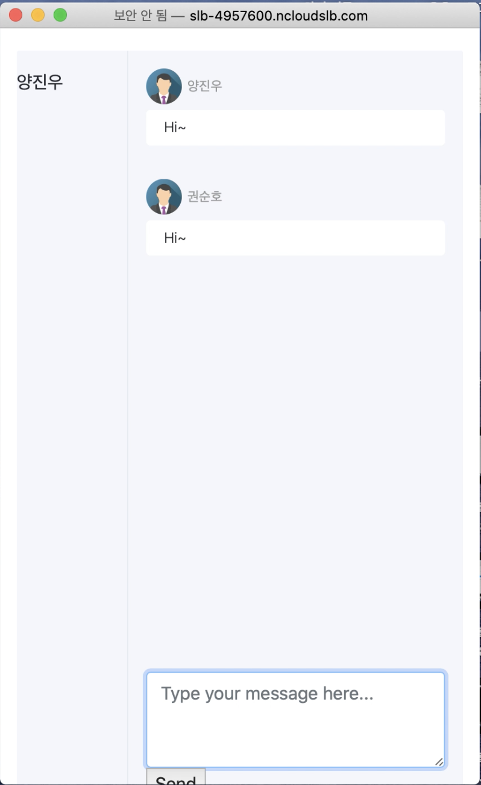

# Chat Service
WQVC(WebRTC-QUIC Video Conference)의 Chat Service 마이크로서비스.

## 사전 설치 요구사항
위 프로그램을 사용하기 전에 `https://github.com/SKrns/WQVC-AUTH`를 설치해야한다.

## 설치 방법
우선 dependencies를 설치한다.

```
pip3 install django
pip3 install py-eureka-client
```

깃 레포를 다운로드한다 

`git clone https://github.com/SKrns/WQVC-CHAT.git`.

레포지토리를 다운로드 한후, 아래 명령어로 chatservice를 실행시킨다.

```
cd WQVC-CHAT

python3 manage.py runserver 7002
```

## 사용방법 
`https://github.com/SKrns/WQVC-AUTH`에서 만든 회의에서 채팅 참가를 누른다. 채팅참가를 누르면 새로운 창이 뜨면 자유롭게 채팅을 이용하면 된다.
